# MindForge

[English](README.md) | **中文**

**一款基于Karpathy LLM-Wiki，会思考、探索、规划、生长的知识铸造平台。把分散的论文、报告与经验，铸造成结构化、可连接、可演进、可对话的知识网络，指导你做研究、找创新、搞创作、生灵感。本地部署，数据不出域，隐私安全。**

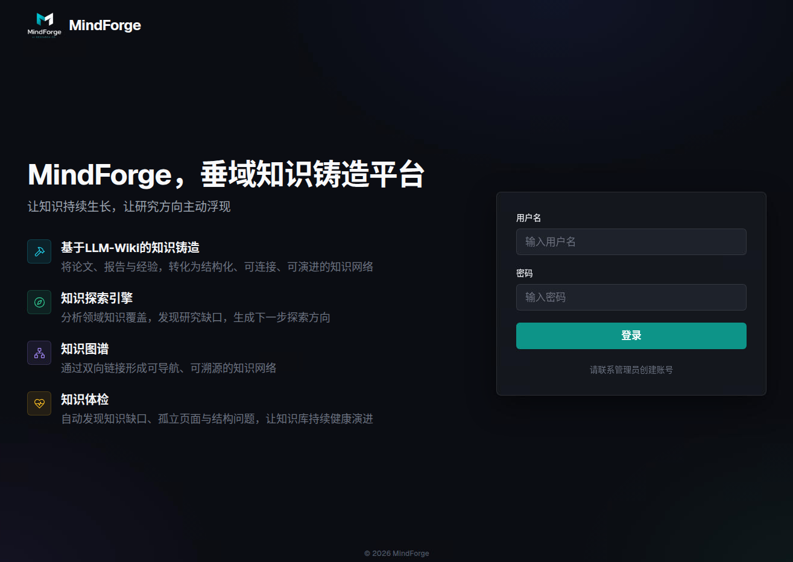


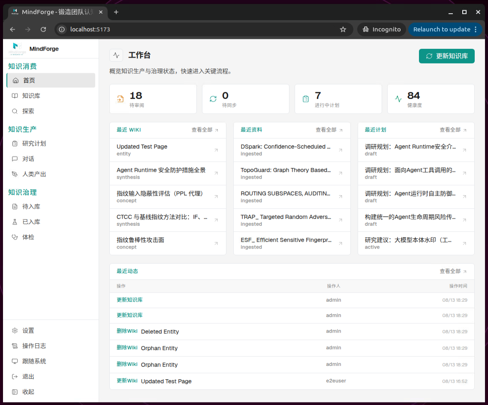


---

## 为什么需要 MindForge？

传统知识库最大的问题是：**知识一旦写进去，就"死"了**

- **知识沉寂**：文档越堆越多，检索靠关键词，找得到却读不完，读完也难提炼出结论
- **有信息，没洞察**：积累了上百份资料，却回答不了"这个领域研究到什么程度了？我们还缺什么？下一步该做什么？"
- **各自为战，重复劳动**：立项、调研、写方案从零开始手搓，团队成员各自为战，重复劳动严重
- **知识质量无人把关**：以次充好的原材料会污染知识库，此外，知识库规模扩大后必然出现结构腐化，概念冲突、信息缺口、孤立页面等问题必须解决

**当信息不再稀缺时，真正稀缺的变成了洞察力、方向感，以及把信息转化为行动的能力。**

MindForge 的核心闭环：

```
探索方向 → 生成计划 → 收集资料 → 人审核入库 → AI 摄入 → 形成 Wiki → 对话 / 再探索
```

在这个闭环里，信息不再只是被"存起来"，而是被**结构化、链接化、可对话化**，持续增值为个人和团队的知识资产。


***

## 适合谁？

- **个人研究者**：理解文献、找创新点、生成研究计划，写论文、做研究快人一步
- **内容创作者**：管理素材、发现选题、问答生成文章骨架，写作从翻收藏夹变成对话素材库
- **研究团队**：做文献综述、技术预研、课题规划，把零散的技术资料变成可对话、可探索的知识网络，立项调研从"天"压缩到"小时"，知识缺口识别让研究方向从经验驱动升级为证据驱动
- **技术团队**：沉淀架构方案、技术调研、产品手册、项目复盘，新人快速 onboarding ，经验不再随人员流动而流失

### 需要注意的是

- 这是铸造"知识"的平台，因此资料需要**人工审核确认价值**后再入库，避免引入噪声。
- **不适合管理海量数据**（海量数据用RAG），Karpathy 本人建议把 LLM-Wiki 管理的文档控制在300篇以内，单篇文档不要超过1万字。
- **适合垂直领域知识铸造**，因此建议不同领域的知识分开建库。
- 本项目在 Linux（Ubuntu）中开发，建议部署在Linux，以web形式提供服务供团队或个人访问使用。


---

## 核心亮点

### 🤝 人机协同 HITL (Human-In-The-Loop) 理念贯穿全程

MindForge 不做"黑盒全自动"的知识库，AI 再强，判断权始终在人手里。

  - 资料入库前：资料须经过"待入库 → 人工审核价值 →批准入库"，避免低质信息污染知识库
  - 更新 wiki 页面前：AI 先输出页面规划（拆几页、每页什么主题、用什么标签），你逐项勾选确认后才生成
  - 问答后：好答案是否沉淀为综合页，由你一键决定
  - 研究计划生成前：AI 先用访谈澄清你的真实需求，而不是拿到一句话就开写
  - 知识库体检时：能确定性修复的（反向链接、索引不一致）一键批量处理，需要判断的（概念冲突、信息缺口）AI 只给建议，改不改、怎么改由你拍板


### 🔨 知识铸造：入库即完整，拒绝压缩式摘要

将论文、报告与经验，转化为结构化、可连接、可演进的知识网络。

一份资料入库后，AI 通过"先规划、人确认后再生成"的两阶段摄入流程，自动拆分为多个结构化 Wiki 页面：

- 实体页（entity）：论文、模型、工具等具体对象；
- 概念页（concept）：方法、理论、技术路线等抽象概念；
- 综合页（synthesis）：跨资料整合对比分析，完整保留对比数据表格。

页面遵循"摘要 + 核心方法 + 关键事实 + 来源"的结构规范；作者、arXiv ID、DOI 等元数据从 PDF 中**真实提取注入，杜绝模型编造引用**。一份论文入库，产出的是接入知识网络的完整信息单元，而非一段被压缩的摘要。


**知识摄入过程示例**

1. **先规划，人确认**

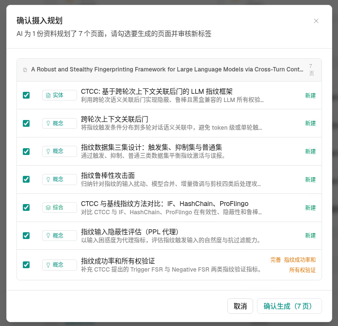

2. **确认后开始逐页构建/完善 wiki 页面**

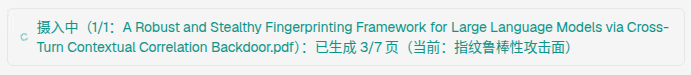

3. **摄入完成，可以在知识库页面看到 wiki 页面**

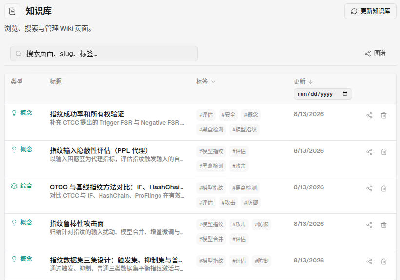


### 🧭 研究指导：引导式访谈，生成可执行的研究计划，阅读清单一键下载

- 输入一个研究方向，AI 通过**选择题式访谈**澄清你的真实需求，再结合知识库上下文与网络/学术调研，输出包含目标、方法、里程碑、风险、研究问题、预期贡献的完整研究计划
- 聚焦高价值方向，不做无用功
- 计划还附带**建议阅读清单，支持一键下载**到待入库，直接进入"审核 → 入库 → 摄入"主流程


**引导式访谈过程**

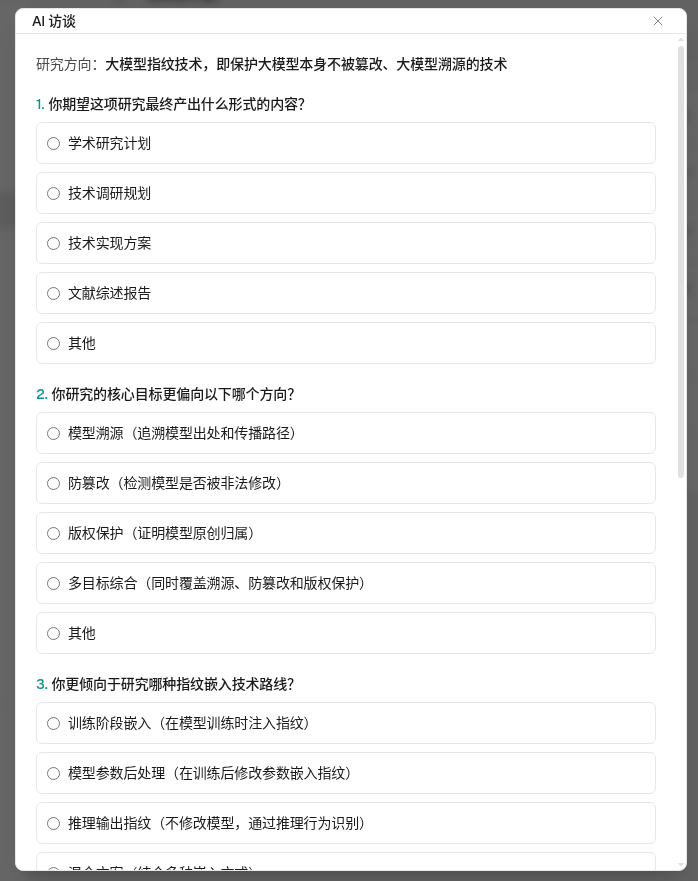

**研究计划 Agent**

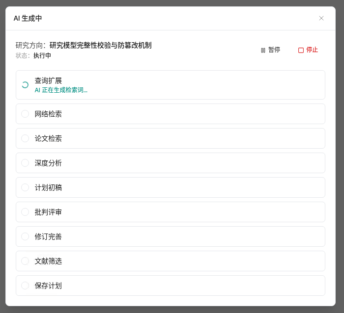

**研究计划-阅读清单一键下载**

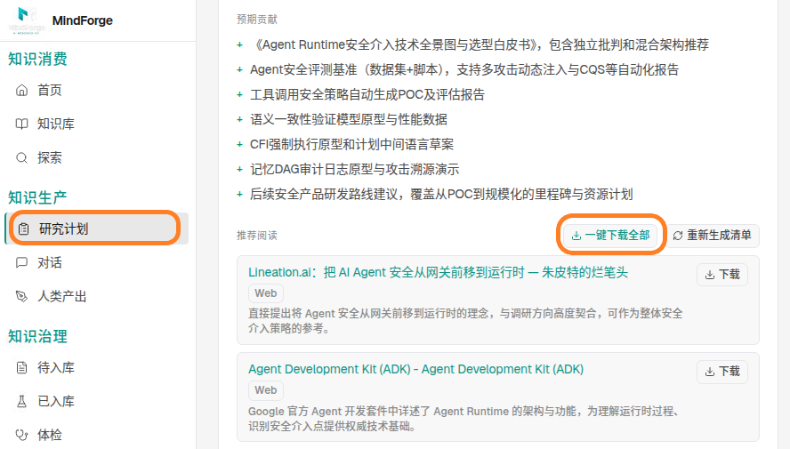


### 🔭 知识探索：发现缺口，给出下一步研究方向，支持一键转为研究计划

- 输入一个模糊方向（如"智能体安全"），AI 基于全库做全局分析，输出三栏结果：**已有知识覆盖盘点、按优先级排序的知识缺口、可执行的研究建议**

- 有价值的建议可一键生成研究计划，探索历史自动保存，随时回溯


**探索结果页（覆盖 / 缺口 / 建议三栏）**

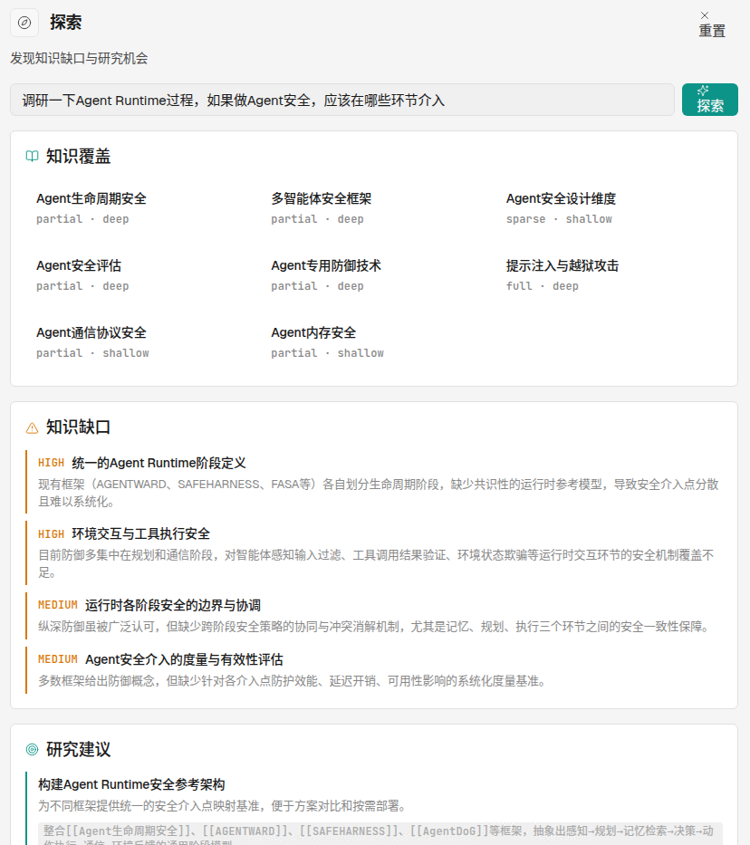

**探索-研究建议-一键生成研究计划**

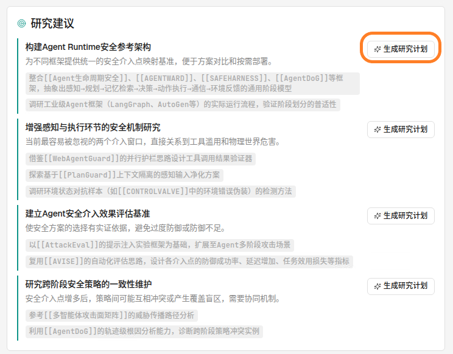


### 🕸️ 知识图谱：知识网络一目了然

页面间通过 `[[slug]]` 双向链接互联，形成可导航、可溯源的知识网络。

- 图谱视图支持缩放、悬停高亮关联节点、点击跳转，支持关键词筛选（展示匹配节点及一度邻居）
- 每个 Wiki 页面可切换到单页图谱视角，聚焦查看某个知识节点的全部关联
- 关联查询纯本地计算，零 LLM 调用，秒开


**知识图谱视图，悬停高亮关联节点，节点可筛选**

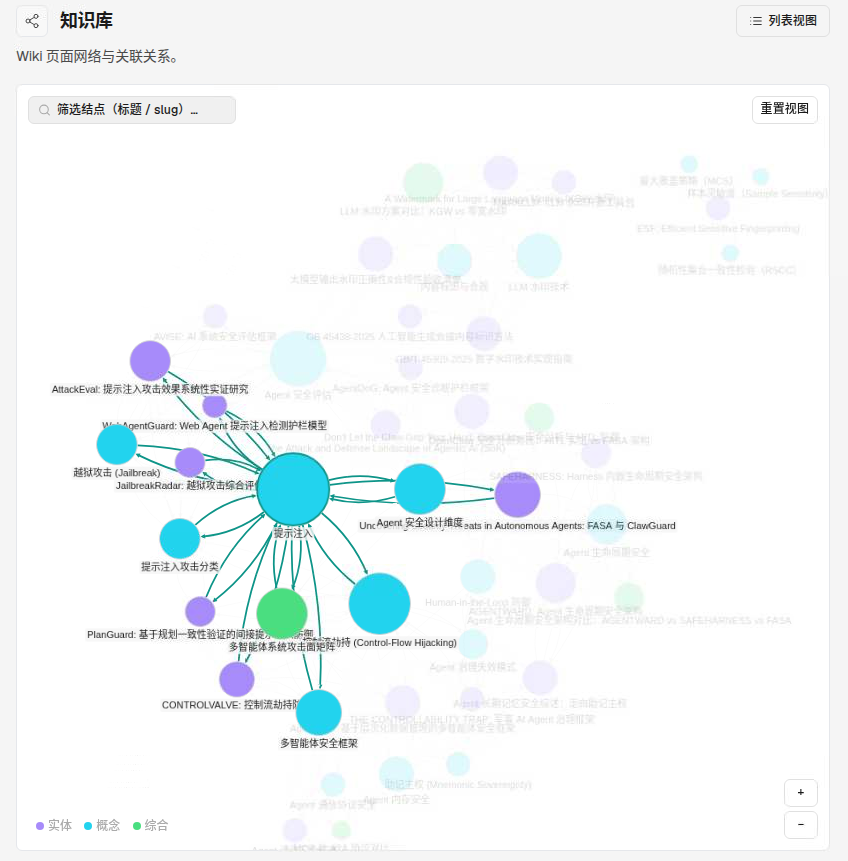

**可聚焦查看某个 Wiki 页面节点的全部关联**

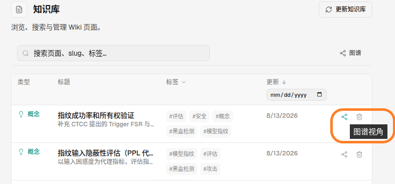


### 💬 专家问答：好答案一键沉淀为知识

- 基于 Wiki 知识库的对话问答：AI 结合库内知识作答，流式输出、Markdown 渲染、来源标注可点击溯源，可信可查

- 好答案都会反哺知识库，越用越聪明：有价值的问答支持**一键生成综合页面**，自动完成摄入流程


**好答案可一键沉淀到知识库**

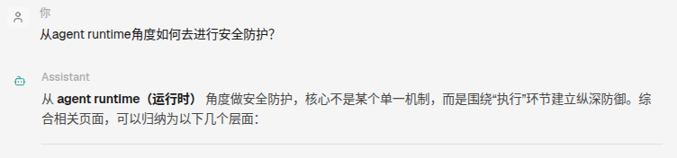

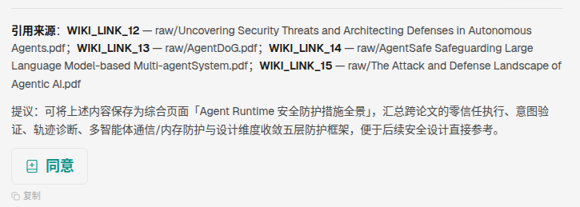

**你点击同意后，系统 自动将回答存为 wiki 页面，好答案都会反哺知识库，越用越聪明**

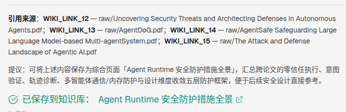


### 🩺 知识体检：一键修复 + 人机协同，知识库越用越健康

知识库规模扩大后必然出现结构腐化。

- 内置体检（Lint）机制检测腐化问题（概念冲突、缺失反向链接、缺失概念、信息缺口、信息过时、孤立页面等）
- 可自动修复项支持**一键批量修复**，需人工判断的问题由 AI 生成修复建议、逐条引导处理
- 健康度量化评分，在首页实时可见，这在同类工具中尚无先例


**体检报告页，摘要卡片 + 一键修复**

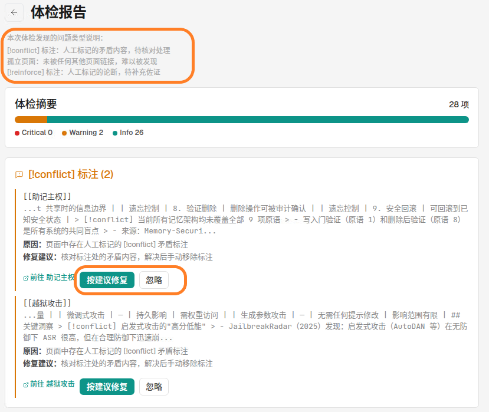


### 👥 团队协作：计划、文献，处处可批注回复

- 研究计划、待入库资料、已入库文献、人类产出，均支持**评论与正文批注**，团队围绕知识资产直接讨论
- 人类产出的研究报告、方案、复盘有专属"人类产出"专区，与 AI 生成内容走统一沉淀路径
- 重操作（摄入、体检、探索）执行期间全团队可见，避免冲突

**团队协作，批注和共识**

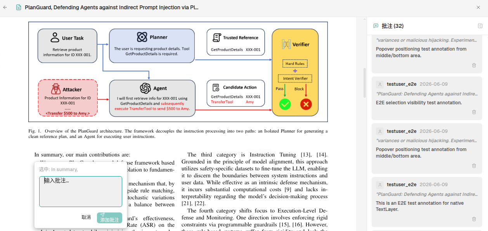


### 🔐 数据安全 & 隐私安全：细粒度权限 + 私有化部署，数据不出域

- admin / editor / viewer 三级角色，写操作全程留痕，操作日志支持按动作、操作人、日期三维审计回溯（个人用户只用admin权限即可）
- 私有化部署：单 Docker 镜像 + SQLite，全部数据在一个 volume 里，不出你的服务器，保证数据安全
- API Key 在你的本地切加密存储，保证隐私安全

**细粒度的权限管控**

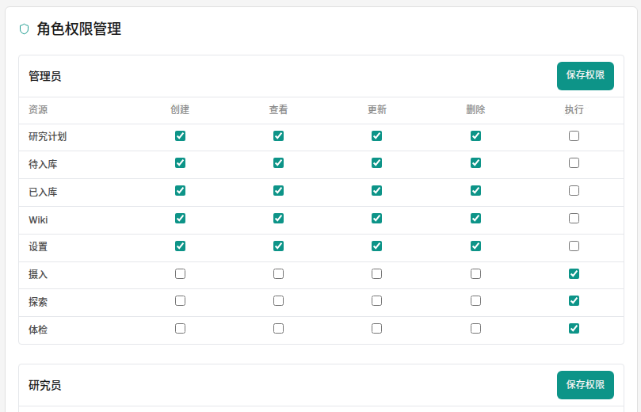


### ⚡ 还有这些细节

- 高信息密度工作台：首页仪表盘一屏掌握待审阅、待同步、进行中计划与健康度
- 全局命令面板：`Cmd/Ctrl + K` 唤起，页面跳转、Wiki/计划/文件搜索一键盘达
- 深色 / 浅色主题，沉浸阅读模式，多格式文档解析（PDF / Word / Markdown / TXT / HTML）


---

## 与同类产品对比

| 维度 | 传统知识库（Confluence 等） | 通用 RAG 问答 | 笔记型 AI（Notion AI 等） | **MindForge** |
|------|------|------|------|------|
| 知识形态 | 静态文档 | 向量切片 | 文档 + AI 润色 | 结构化多页 Wiki 网络 |
| 信息保真 | 原文堆积，无提炼 | 摘要压缩，细节丢失 | 依赖人工整理 | 入库即完整结构化提取 |
| 跨文档洞察 | 无 | 弱（切片级检索） | 无 | 综合页 + 全局探索分析 |
| 缺口发现 | 无 | 无 | 无 | **主动识别知识缺口并生成计划** |
| 知识治理 | 人工维护 | 无治理概念 | 无 | 体检 + 一键修复 + 健康度量化 |
| 研究规划 | 无 | 无 | 无 | 探索 → 计划 → 执行闭环 |
| 人类智慧沉淀 | 有（但割裂） | 无 | 有 | 专区管理 + 统一入库路径 |
| 可控性 | 依厂商而定 | 依厂商而定 | 云端绑定 | LLM 可配置、完全私有化部署 |


***

## 快速开始

先拉取本仓库到你本地，进入本地仓库路径，例如，

```bash
cd /home/admin/project/mindforge
```

### Docker 一键部署（推荐）

```bash
docker build -t mindforge .
docker run -d --name mindforge -p 18333:80 -v mindforge-data:/data mindforge
```

或使用 Docker Compose：

```bash
docker compose up -d
```

然后打开 **http://localhost:18333** （端口号如18333，可根据你的系统情况自定）

#### 停止服务

```bash
docker stop mindforge  
```

#### 重启服务

```bash
docker start mindforge           # 启动已 stop 的容器
# 或者
docker restart mindforge         # 重启
```

#### 彻底卸载（数据也删掉）

```bash
docker compose down -v
```


### 首次使用

1. 使用初始账号 **`admin` / `admin`** 登录，首次登录会**强制修改密码**
2. 进入**设置**页，配置你自己的大模型（API Key / Base URL / 模型名称），选择默认模型（MindForge 在你的本地私有化部署，API Key加密存储）
3. 你的知识库从**空白**开始。建议按以下步骤建立第一个知识闭环：
   - 在**待入库**上传 3–5 份核心论文 / 报告（单篇不要超过1万字）
   - 审阅后点击"入库"，然后在**首页**或知识页或**已入库页**中点击「更新知识库」按钮，等待（该过程时长与你用的大模型和摄入的资料数有关）
   - 到**探索**模块输入你的研究方向，看看 AI 识别出的知识缺口和研究建议
   - 对有价值的建议点击"生成研究计划"，系统会采访你然后生成详细的研究指导，以及文献清单
   - 使用一段时间后，在**体检**模块做一次健康检查，一键修复结构问题
   
   

### 数据持久化

所有状态（SQLite 数据库、上传的文件、Wiki 页面、自动生成的密钥）都在 `/data` volume 中，备份只需复制该 volume，别无他处（Linux 默认在 /var/lib/docker/volumes/ 下）

```bash
# 查看数据位置
docker volume inspect mindforge-data
```


### 配置项

| 环境变量 | 默认值 | 说明 |
|---|---|---|
| `DATA_DIR` | `/data` | 全部运行时数据的存储位置 |
| `DATABASE_URL` | `sqlite:////data/mindforge.db` | SQLAlchemy 连接串（默认 SQLite） |
| `SECRET_KEY` | *（自动生成）* | JWT 签名密钥；未设置时持久化到 `/data/.secrets` |
| `ENCRYPTION_KEY` | *（自动生成）* | 加密存储的 LLM API Key；未设置时持久化到 `/data/.secrets` |
| `CORS_ORIGINS` | `http://localhost:5173,...` | 仅开发环境需要；Docker 同源部署不涉及 |

> ⚠️ 如果将已有的 `/data` 目录迁移到新主机，请保留相同的 `ENCRYPTION_KEY`（或 `.secrets` 文件），否则已存储的 LLM API Key 将无法解密。


---

## 技术架构

- **后端**：FastAPI + SQLAlchemy + SQLite（Alembic 迁移），JWT 认证，基于角色的权限控制，全量审计日志
- **前端**：React + TypeScript + Vite + Tailwind + zustand，cytoscape 知识图谱
- **AI**：OpenAI 兼容接口，按部署自行配置；两阶段摄入（规划 → 确认 → 逐页生成）让 LLM 始终在人类把关下工作；能确定性完成的（索引重建、断链检查、图谱关联）零 LLM 调用，长期运营成本从 O(N²) 降为 O(N)
- **部署**：单镜像 All-in-One，nginx 托管前端并反代 `/api` 到同容器 uvicorn，SQLite 落在 volume 上，启动自动迁移


### 本地开发

```bash
# 后端（Python 3.10+，FastAPI）
cd backend
pip install -r requirements.txt
uvicorn app.main:app --reload          # http://localhost:8000

# 前端（Node 20+，React + Vite + Tailwind）
cd frontend
npm ci
npm run dev                            # http://localhost:5173（代理 /api）
```

检查：

```bash
cd backend && python3 -m pytest tests/ -q
cd frontend && npx tsc --noEmit && npx vite build
```


---

## License 许可证

**License**: [BUSL-1.1](LICENSE) — free for self-hosting (including internal
company use), learning and research; commercial use (SaaS, resale,
white-label) requires a separate license (dengsha1990@gmail.com). Each release
converts to GPLv3 four years after publication.


MindForge 是**源码可见（Source Available）**项目，采用
[Business Source License 1.1](LICENSE)（BUSL-1.1），**不是** OSI 认证的开源许可证。

你可以：

- ✓ 自行部署 MindForge —— **包括在公司内部使用，免费**
- ✓ 用于学习、学术研究和非商业实验
- ✓ 为上述用途修改源代码
- ✓ Fork 并回馈贡献（见 [CONTRIBUTING.md](CONTRIBUTING.md)）

商业用途——将 MindForge 作为 SaaS 对外提供、转售、白标、付费私有交付——**需要单独授权**，详见 [docs/COMMERCIAL_LICENSE.md](docs/COMMERCIAL_LICENSE.md)。

每个版本在发布**四年后自动转为 GPLv3**。

MindForge 名称与 Logo 受保护，见 [TRADEMARK.md](TRADEMARK.md)。

---

## 社区与贡献

这是我第一次独立开源一个完整系统——从产品设计、前后端到部署打磨，尽了我当前最大的努力，但肯定还有很多不足：交互可以更顺、代码可以更优雅、文档可以更完善。**如果你在使用中遇到问题，或者有任何改进想法，欢迎提 Issue、提 PR**，让我们一起把它变得更好。

每一个 Star、每一条反馈，都是对我最大的鼓励。🙏

- **Issues & PRs**：见 [CONTRIBUTING.md](CONTRIBUTING.md)
- **商业授权联系**：dengsha1990@gmail.com

### 关于我

如果 MindForge 对你有帮助，也欢迎关注我，会持续分享独立开发与 AI 应用实践：

- **公众号**：sudden的AI日常
- **知乎**：sudden，https://www.zhihu.com/people/cddengsha


*English README: [README.md](README.md).*
