# MindForge

**English** | [中文](README-zh.md)

**A knowledge-forging platform built on Karpathy's LLM-Wiki that thinks, explores, plans, and grows. It turns scattered papers, reports, and experience into a structured, connected, evolving, conversational knowledge network — guiding your research, innovation, creation, and inspiration. Self-hosted, data never leaves your domain, privacy-safe.**

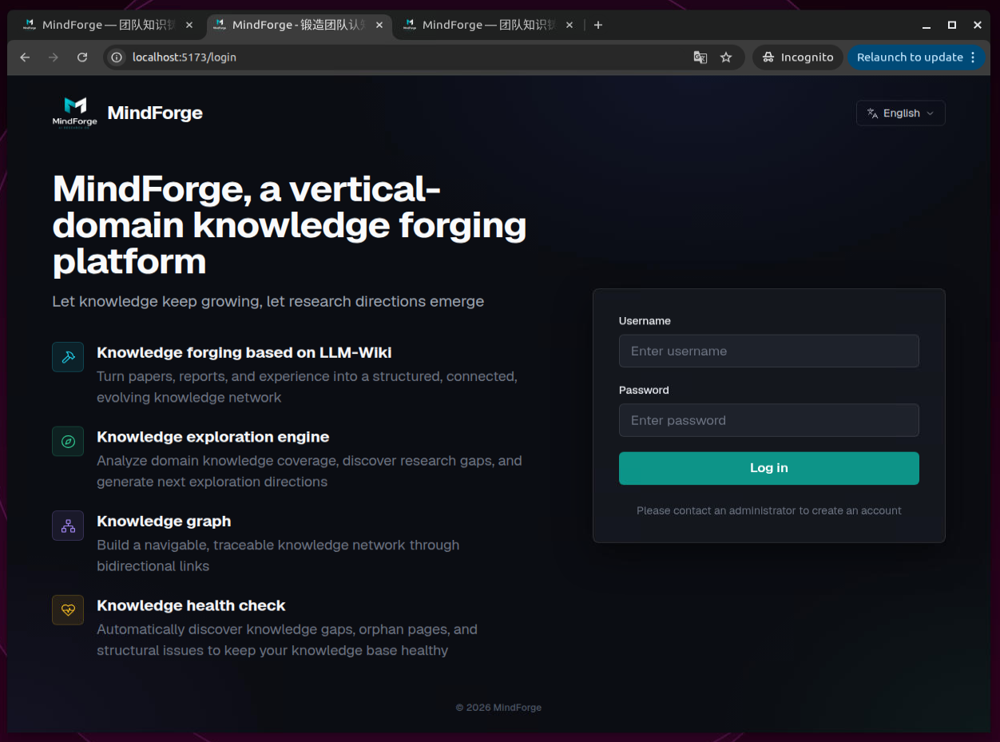

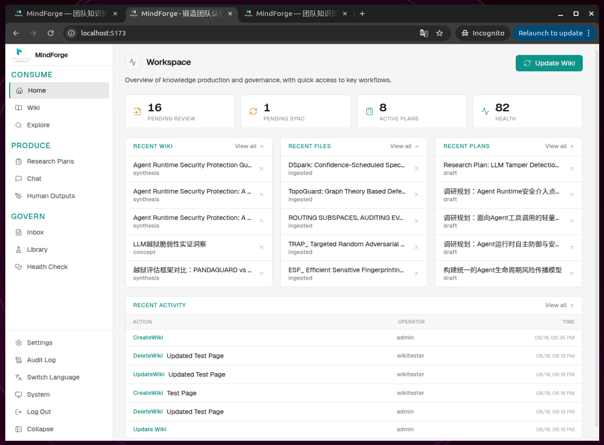

---

## Why MindForge?

The biggest problem with traditional knowledge bases is: **once knowledge is written in, it goes "dead"**

- **Knowledge goes dormant**: documents pile up, retrieval relies on keywords — you can find things but never finish reading them, and even after reading, it's hard to distill conclusions
- **Information without insight**: you've accumulated hundreds of documents, yet can't answer "How far has research in this field progressed? What are we missing? What should we do next?"
- **Everyone works in silos, duplicating effort**: project proposals, surveys, and write-ups are hand-crafted from scratch; team members duplicate each other's work
- **No one guards knowledge quality**: subpar raw material pollutes the knowledge base, and as it grows, structural decay is inevitable — concept conflicts, information gaps, orphan pages, and more must be addressed

**When information is no longer scarce, what's truly scarce becomes insight, a sense of direction, and the ability to turn information into action.**

MindForge's core loop:

```
Explore a direction → generate a plan → collect materials → human review & ingest → AI ingestion → Wiki forms → converse / explore again
```

In this loop, information is no longer just "stored" — it is **structured, linked, and made conversational**, continuously compounding into a knowledge asset for individuals and teams.


***

## Who is it for?

- **Individual researchers**: understand literature, find innovation points, generate Research Plans — write papers and do research a step ahead
- **Content creators**: manage materials, discover topics, generate article skeletons via Q&A — writing shifts from digging through bookmarks to conversing with your material library
- **Research teams**: literature reviews, technology scouting, project planning — turn scattered technical materials into a conversational, explorable knowledge network; compress proposal research from "days" to "hours"; knowledge-gap identification upgrades research direction from experience-driven to evidence-driven
- **Engineering teams**: distill architecture designs, technical research, product manuals, and project retrospectives; onboard new members fast; experience no longer walks out the door with departing staff

### Things to note

- This is a platform for forging "knowledge", so materials must be **manually reviewed for value** before Ingest, to keep noise out.
- **Not suited for managing massive datasets** (use RAG for that). Karpathy himself recommends keeping an LLM-Wiki to under 300 documents, with each document under 10,000 words.
- **Best for vertical-domain knowledge forging** — it's recommended to build separate wikis for different domains.
- This project was developed on Linux (Ubuntu). We recommend deploying on Linux and serving it as a web app for team or personal access.


---

## Core Highlights

### 🤝 Human-in-the-Loop (HITL) collaboration throughout

MindForge is not a "black-box, fully automated" knowledge base. No matter how strong the AI gets, judgment stays in human hands.

  - Before Ingest: materials must go through "Inbox → human review of value → approve for Ingest", keeping low-quality information from polluting the Wiki
  - Before updating Wiki pages: the AI first outputs a page plan (how many pages, each page's topic, which tags) — generation only starts after you check off and confirm each item
  - After Q&A: whether a good answer is distilled into a synthesis page is your one-click decision
  - Before generating a Research Plan: the AI first interviews you to clarify your real needs, instead of writing from a single sentence
  - During Wiki Health Check: deterministically fixable issues (backlinks, index inconsistencies) are batch-fixed with one click; issues requiring judgment (concept conflicts, information gaps) get AI suggestions only — whether and how to fix them is your call


### 🔨 Knowledge forging: complete upon Ingest — no lossy summaries

Turn papers, reports, and experience into a structured, connected, evolving knowledge network.

Once a document is ingested, the AI — through a two-stage "plan first, generate after human confirmation" ingestion flow — automatically splits it into multiple structured Wiki pages:

- Entity pages: concrete objects such as papers, models, and tools
- Concept pages: abstract concepts such as methods, theories, and technical approaches
- Synthesis pages: cross-document integration and comparative analysis, fully preserving comparison tables

Pages follow the structure of "summary + core methods + key facts + sources"; metadata like authors, arXiv IDs, and DOIs are **genuinely extracted from the PDF and injected, eliminating model-fabricated citations**. One paper in produces a complete information unit wired into the knowledge network — not a compressed summary.


**Knowledge ingestion walkthrough**

1. **Plan first, human confirms**

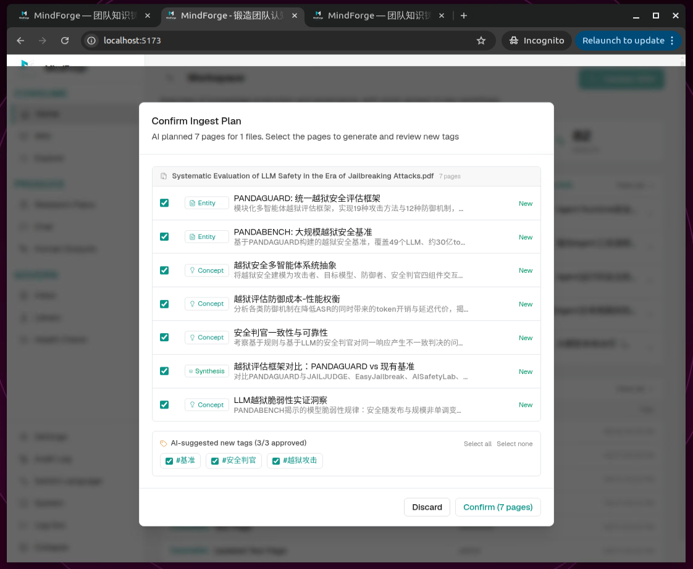

2. **After confirmation, Wiki pages are built/refined one by one**

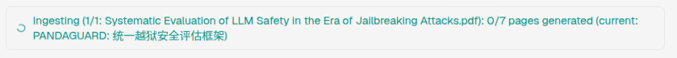

3. **Ingestion complete — Wiki pages visible on the Wiki page**

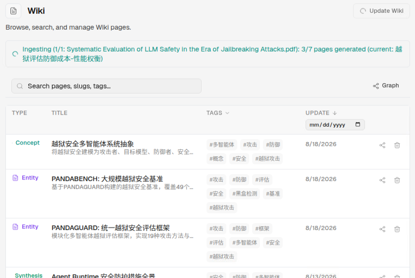


### 🧭 Research guidance: guided interviews produce actionable Research Plans, with one-click Reading List downloads

- Enter a research direction, and the AI clarifies your real needs through a **multiple-choice interview**, then — combining Wiki context with web/academic research — outputs a complete Research Plan covering goals, methods, milestones, risks, research questions, and expected contributions
- Focus on high-value directions; no wasted effort
- Plans come with a **suggested Reading List, downloadable in one click** to the Inbox, flowing directly into the "review → Ingest → ingestion" main pipeline


**Guided interview process**

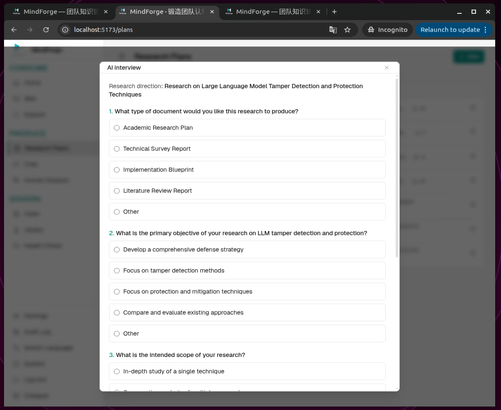


**Research Plan agent**

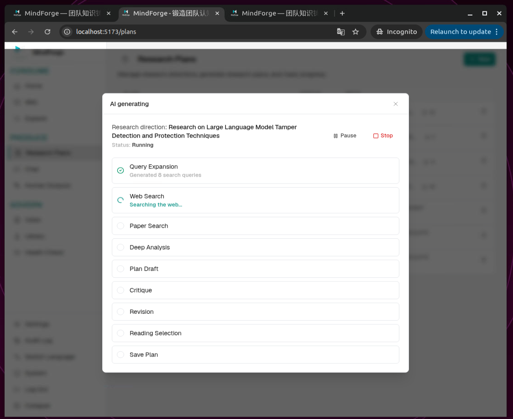


**Research Plan - one-click Reading List download**

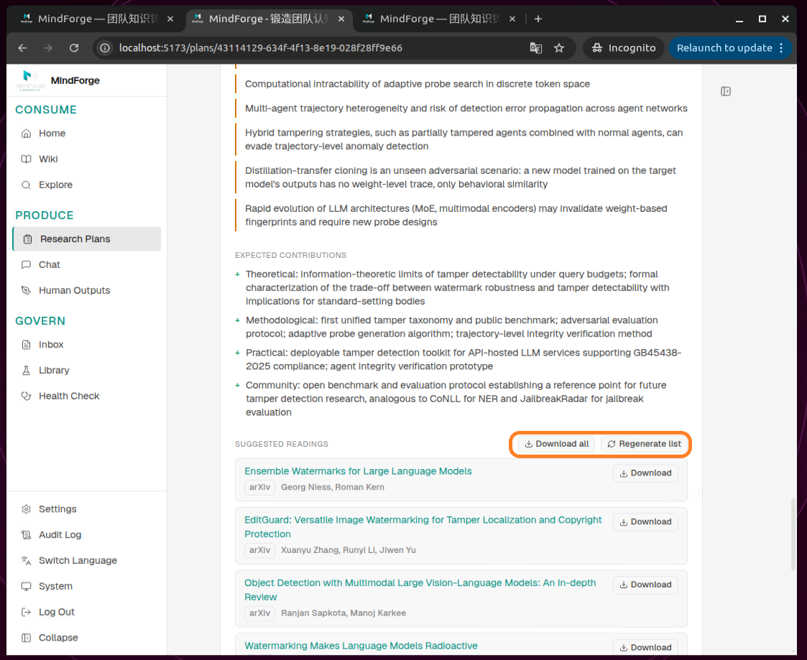


### 🔭 Explore: discover gaps, get next-step research directions, convert to Research Plans in one click

- Enter a fuzzy direction (e.g., "agent safety"), and the AI runs a global analysis over the entire Wiki, outputting three columns: **existing knowledge coverage, knowledge gaps ranked by priority, and actionable research suggestions**

- Valuable suggestions can be turned into Research Plans in one click; exploration history is saved automatically for easy backtracking


**Explore results page (coverage / gaps / suggestions in three columns)**

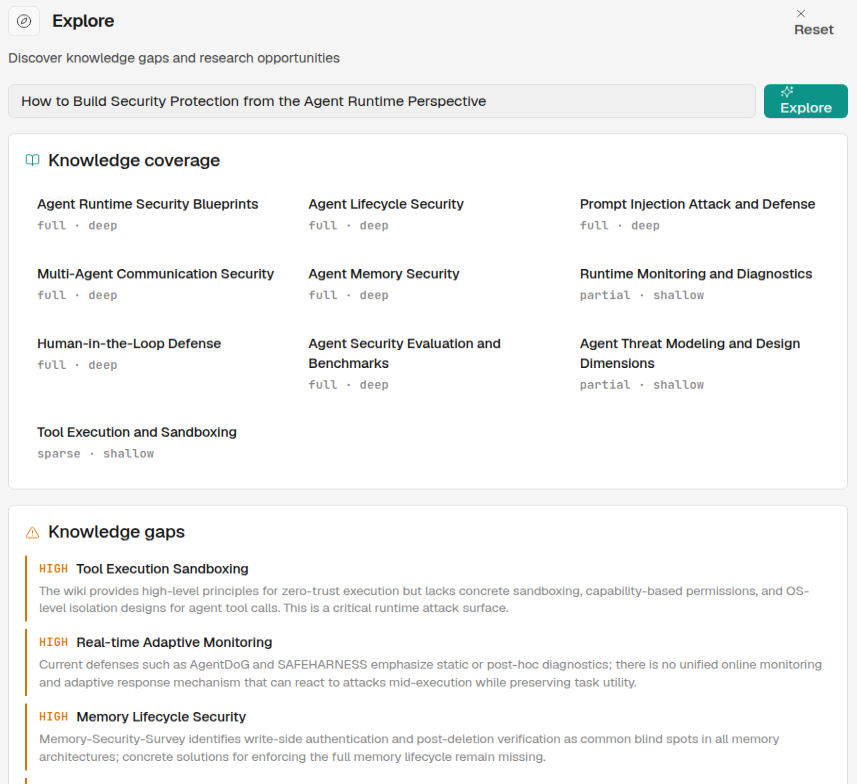


**Explore - research suggestion - one-click Research Plan generation**

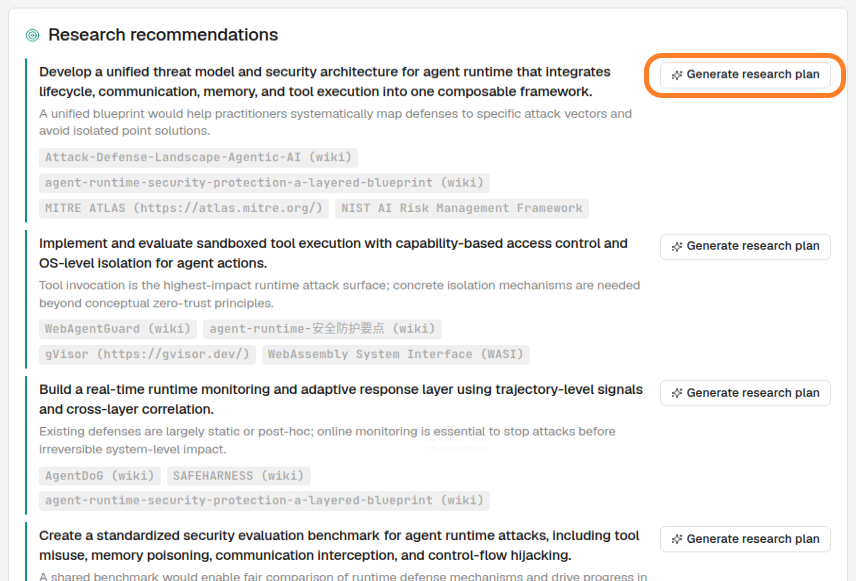


### 🕸️ Knowledge Graph: the knowledge network at a glance

Pages interconnect via `[[slug]]` bidirectional links, forming a navigable, traceable knowledge network.

- The graph view supports zooming, hover-highlighting of related nodes, click-to-jump, and keyword filtering (showing matched nodes and their one-hop neighbors)
- Every Wiki page can switch to a single-page graph view, focusing on all connections of one knowledge node
- Relationship queries are computed purely locally — zero LLM calls, opens in a flash


**Knowledge Graph view: hover to highlight related nodes, nodes filterable**

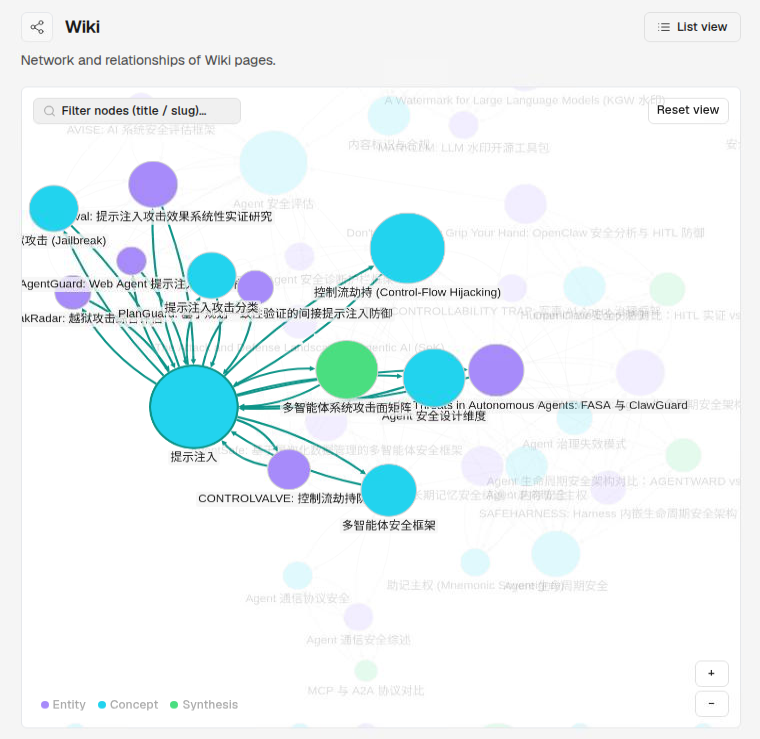

**Focus on all connections of a single Wiki page node**

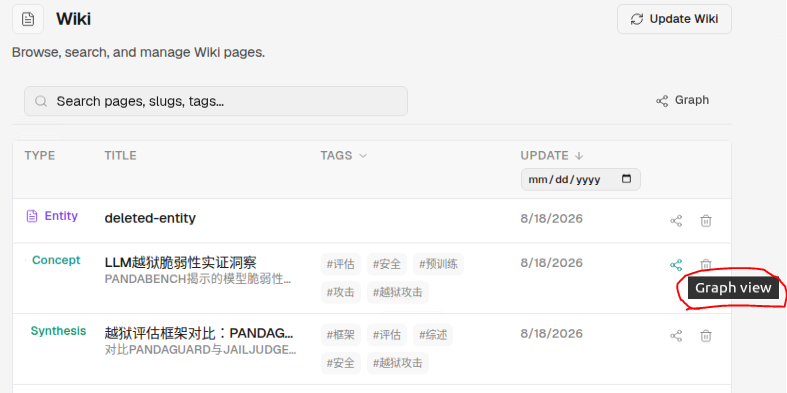


### 💬 Expert Q&A: distill great answers into knowledge with one click

- Conversational Q&A grounded in the Wiki: the AI answers with in-Wiki knowledge, with streaming output, Markdown rendering, and clickable source citations — trustworthy and verifiable

- Great answers feed back into the Wiki, so it gets smarter the more you use it: valuable Q&As can be **turned into synthesis pages with one click**, automatically running the ingestion flow


**Great answers can be distilled into the Wiki with one click**

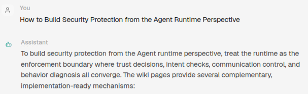

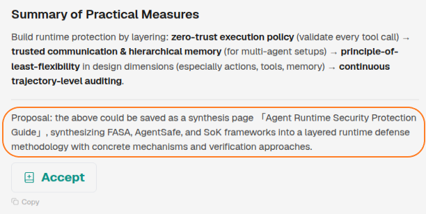


**Once you click approve, the system automatically saves the answer as a Wiki page — great answers feed back into the Wiki, which gets smarter the more you use it**

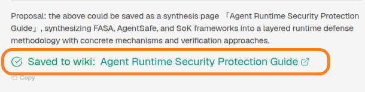


### 🩺 Health Check: one-click fixes + human-AI collaboration, keeping your Wiki healthy as it grows

Structural decay is inevitable as a Wiki scales.

- A built-in lint mechanism detects decay problems (concept conflicts, missing backlinks, missing concepts, information gaps, stale information, orphan pages, etc.)
- Auto-fixable items support **one-click batch repair**; issues requiring human judgment get AI-generated fix suggestions with guided, item-by-item handling
- A quantified health score is visible in real time on the home page — unprecedented among comparable tools


**Health Check report page: summary cards + one-click fixes**

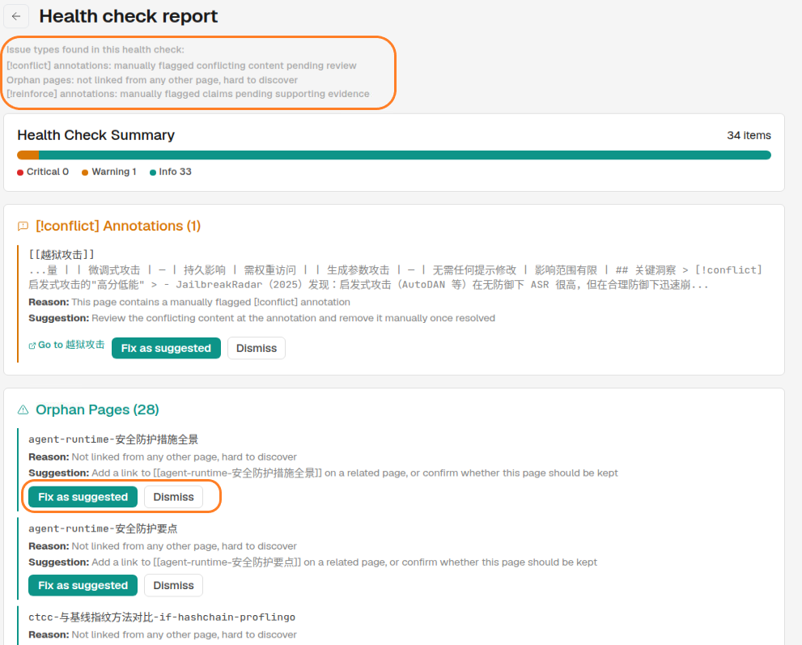


### 👥 Team collaboration: annotate and reply on plans and literature, everywhere

- Research Plans, Inbox items, ingested literature, and Human Outputs all support **comments and inline annotations** — teams discuss directly around knowledge assets
- Human-written research reports, proposals, and retrospectives have a dedicated "Human Outputs" section, following the same ingestion path as AI-generated content
- Heavy operations (Ingest, Health Check, Explore) are visible to the whole team while running, avoiding conflicts

**Team collaboration: annotations and consensus**

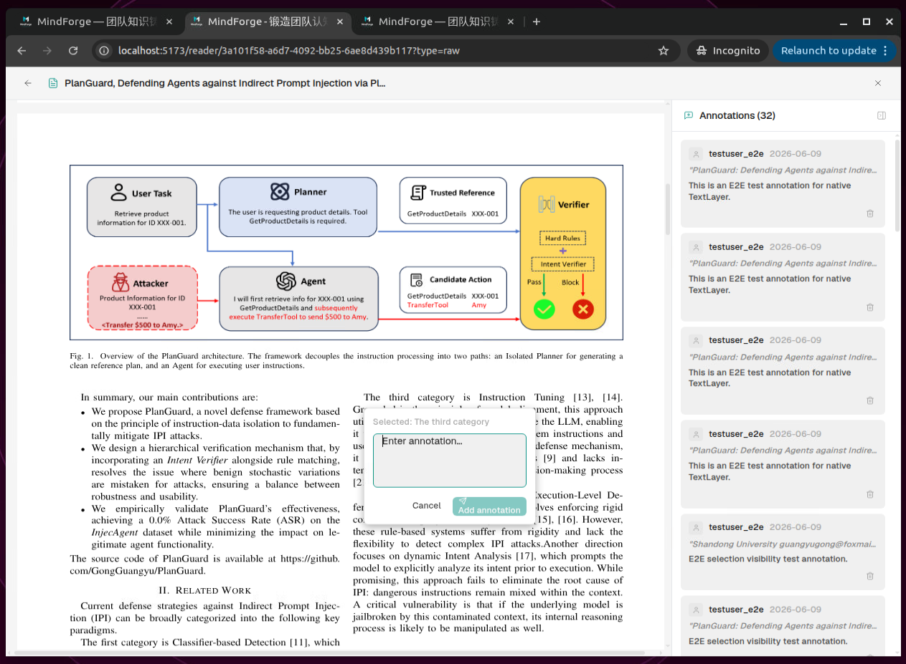


### 🔐 Data security & privacy: fine-grained permissions + self-hosted deployment, data never leaves your domain

- Three role levels: admin / editor / viewer. All write operations are fully logged; the Audit Log supports three-dimensional auditing by action, operator, and date (individual users only need admin)
- Self-hosted: a single Docker image + SQLite; all data lives in one volume and never leaves your server, ensuring data security
- API Keys are stored encrypted locally, ensuring privacy

**Fine-grained permission control**

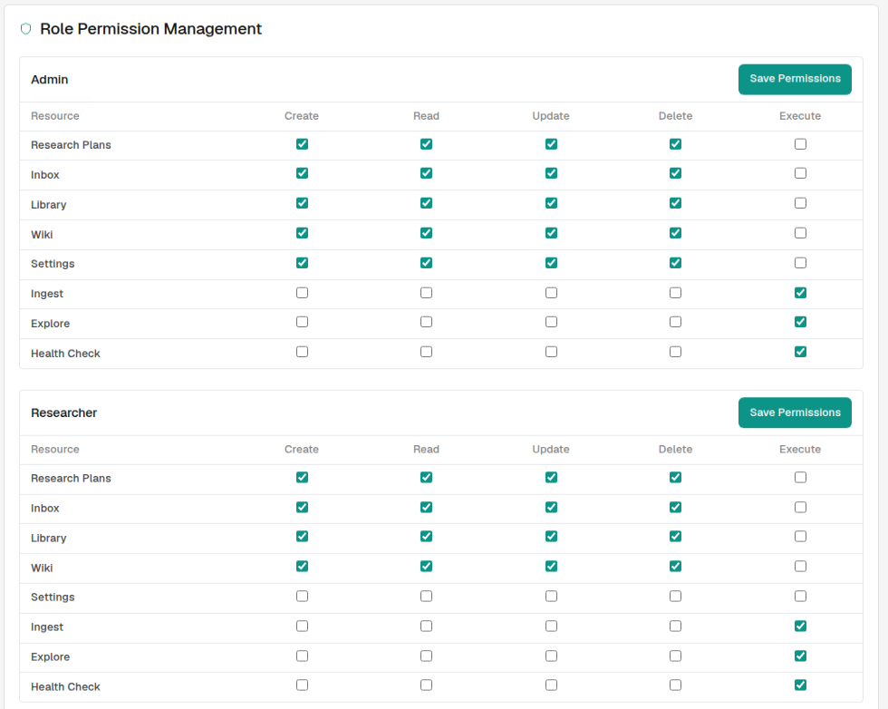


### ⚡ And these details too

- High-information-density workspace: the home dashboard shows pending reviews, pending syncs, in-progress plans, and health at a glance
- Global command palette: `Cmd/Ctrl + K` — page navigation and Wiki/plan/file search, one keystroke away
- Dark / light themes, immersive reading mode, multi-format document parsing (PDF / Word / Markdown / TXT / HTML)


---

## Comparison with similar products

| Dimension | Traditional knowledge bases (Confluence, etc.) | Generic RAG Q&A | Note-taking AI (Notion AI, etc.) | **MindForge** |
|------|------|------|------|------|
| Knowledge form | Static documents | Vector chunks | Documents + AI polish | Structured multi-page Wiki network |
| Information fidelity | Raw text piled up, no distillation | Summary compression, details lost | Relies on manual curation | Complete structured extraction upon Ingest |
| Cross-document insight | None | Weak (chunk-level retrieval) | None | Synthesis pages + global Explore analysis |
| Gap discovery | None | None | None | **Proactively identifies knowledge gaps and generates plans** |
| Knowledge governance | Manual maintenance | No concept of governance | None | Health Check + one-click fixes + quantified health score |
| Research planning | None | None | None | Explore → plan → execute loop |
| Human wisdom capture | Yes (but siloed) | None | Yes | Dedicated section + unified ingestion path |
| Controllability | Vendor-dependent | Vendor-dependent | Cloud-locked | Configurable LLM, fully self-hosted |


***

## Quick Start

First clone this repository locally and enter the repo path, e.g.,

```bash
cd /home/admin/project/mindforge
```

### One-click Docker deployment (recommended)

```bash
docker build -t mindforge .
docker run -d --name mindforge -p 18333:80 -v mindforge-data:/data mindforge
```

Or use Docker Compose:

```bash
docker compose up -d
```

Then open **http://localhost:18333** (the port, e.g. 18333, can be adjusted to your system)

#### Stop the service

```bash
docker stop mindforge  
```

#### Restart the service

```bash
docker start mindforge           # start a stopped container
# or
docker restart mindforge         # restart
```

#### Full uninstall (data deleted too)

```bash
docker compose down -v
```


### First-time use

1. Log in with the initial account **`admin` / `admin`** — you'll be **forced to change the password** on first login
2. Go to the **Settings** page and configure your own LLM (API Key / Base URL / model name), then pick a default model (MindForge is self-hosted on your machine; API Keys are stored encrypted)
3. Your Wiki starts **empty**. Recommended steps to build your first knowledge loop:
   - Upload 3–5 core papers / reports in the **Inbox** (each under 10,000 words)
   - After reviewing, click "Ingest", then click the "Update Wiki" button on the **home page**, Wiki page, or **Ingested page**, and wait (duration depends on your LLM and the amount of material ingested)
   - Go to the **Explore** module, enter your research direction, and see the knowledge gaps and research suggestions the AI identifies
   - Click "Generate Research Plan" on valuable suggestions — the system will interview you, then produce detailed research guidance plus a literature list
   - After using it for a while, run a checkup in the **Health Check** module and fix structural issues with one click
   
   

### Data persistence

All state (SQLite database, uploaded files, Wiki pages, auto-generated secrets) lives in the `/data` volume. Backing up means copying that volume — nothing else (on Linux, it's under `/var/lib/docker/volumes/` by default)

```bash
# inspect the data location
docker volume inspect mindforge-data
```


### Configuration

| Environment variable | Default | Description |
|---|---|---|
| `DATA_DIR` | `/data` | Storage location for all runtime data |
| `DATABASE_URL` | `sqlite:////data/mindforge.db` | SQLAlchemy connection string (SQLite by default) |
| `SECRET_KEY` | *(auto-generated)* | JWT signing key; persisted to `/data/.secrets` if unset |
| `ENCRYPTION_KEY` | *(auto-generated)* | Encrypts stored LLM API Keys; persisted to `/data/.secrets` if unset |
| `CORS_ORIGINS` | `http://localhost:5173,...` | Only needed in development; irrelevant for same-origin Docker deployment |

> ⚠️ If migrating an existing `/data` directory to a new host, keep the same `ENCRYPTION_KEY` (or the `.secrets` file), otherwise stored LLM API Keys cannot be decrypted.


---

## Tech Stack

- **Backend**: FastAPI + SQLAlchemy + SQLite (Alembic migrations), JWT auth, role-based access control, full audit logging
- **Frontend**: React + TypeScript + Vite + Tailwind + zustand, cytoscape Knowledge Graph
- **AI**: OpenAI-compatible API, configured per deployment; two-stage ingestion (plan → confirm → page-by-page generation) keeps the LLM working under human oversight; everything deterministic (index rebuilds, broken-link checks, graph relationships) uses zero LLM calls, cutting long-term operating cost from O(N²) to O(N)
- **Deployment**: single all-in-one image; nginx serves the frontend and reverse-proxies `/api` to uvicorn in the same container; SQLite lives on a volume; automatic migrations on startup


### Local development

```bash
# Backend (Python 3.10+, FastAPI)
cd backend
pip install -r requirements.txt
uvicorn app.main:app --reload          # http://localhost:8000

# Frontend (Node 20+, React + Vite + Tailwind)
cd frontend
npm ci
npm run dev                            # http://localhost:5173 (proxies /api)
```

Checks:

```bash
cd backend && python3 -m pytest tests/ -q
cd frontend && npx tsc --noEmit && npx vite build
```


---

## License

**License**: [BUSL-1.1](LICENSE) — free for self-hosting (including internal
company use), learning and research; commercial use (SaaS, resale,
white-label) requires a separate license (dengsha1990@gmail.com). Each release
converts to GPLv3 four years after publication.


MindForge is a **Source Available** project under the
[Business Source License 1.1](LICENSE) (BUSL-1.1), which is **not** an OSI-approved open source license.

You may:

- ✓ Self-host MindForge — **including internal company use, free of charge**
- ✓ Use it for learning, academic research, and non-commercial experiments
- ✓ Modify the source code for the above purposes
- ✓ Fork and contribute back (see [CONTRIBUTING.md](CONTRIBUTING.md))

Commercial use — offering MindForge as a SaaS, resale, white-labeling, or paid private delivery — **requires a separate license**. See [docs/COMMERCIAL_LICENSE.md](docs/COMMERCIAL_LICENSE.md).

Each release **automatically converts to GPLv3 four years after publication**.

The MindForge name and logo are protected; see [TRADEMARK.md](TRADEMARK.md).

---

## Community & Contributing

This is my first time independently open-sourcing a complete system — from product design and full-stack development to deployment polish. I've given it my best current effort, but there's surely room to improve: smoother interactions, more elegant code, better documentation. **If you run into issues or have any ideas for improvement, Issues and PRs are very welcome** — let's make it better together.

Every star and every piece of feedback means the world to me. 🙏

- **Issues & PRs**: see [CONTRIBUTING.md](CONTRIBUTING.md)
- **Commercial licensing**: dengsha1990@gmail.com

### About me

If MindForge helps you, feel free to follow me — I regularly share hands-on experience with indie development and AI applications:

- **WeChat Official Account**: sudden的AI日常
- **Zhihu**: sudden, https://www.zhihu.com/people/cddengsha


*中文版 README 请见 [README-zh.md](README-zh.md)。*

